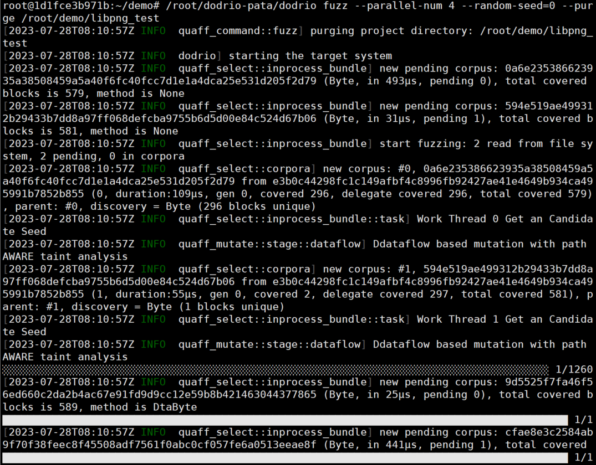

# Artifact for "Dodrio: Parallelizing Taint Analysis Based Fuzzing via Redundancy-Free Scheduling"

The artifact consists of the following contents:

1. An implementation of `Dodrio` (`Dodrio-FairFuzz` and `Dodrio-FairPATA`) to do fuzzing for the tested projects and to find all bugs reported in the paper.

1. A tutorial to introduce how to use `Dodrio`.

2. All discovered seeds and bugs triggered by  `Dodrio`. They can be found in the ./data directory. The found seeds give the results of the experiment for `Dodrio-FairFuzz` and `Dodrio-PATA `with 4 cores in 24 hours. From these seeds, researchers could easily access the final results of our tool.  As a result, we believe our artifact can be easily reused for future research projects.   

The directory tree  is as follows:

   ```
   .
   |-- Dockerfile
   |-- data
   |   |-- dodrio-fairfuzz
   |   |-- dodrio-pata
   |   `-- readme.md
   |-- docker_files
   |   |-- demo
   |   |-- dodrio-fairfuzz
   |   `-- dodrio-pata
   |-- img
   ```

   

## Dodrio

Dodrio parallelizes taint analysis based fuzzing via redundancy-free scheduling. The framework has two modules, namely real-time state synchronization and load-balanced task dispatch. First, it utilizes dual coverage global bitmaps for real-time state synchronization. Correspondingly, it has a global seed cache queue and a global seed pool. The fast global bitmap, protected by fine-grained locks, is used to coarsely filter generated seeds to the cache queue, and an accurate bitmap is used to further sift them to the pool. Moreover, it uses load-balanced task dispatch to distribute different fuzzing tasks across multiple fuzzer instances. When idle instances request tasks, it dispatches saving tasks if there are candidate seeds in the cache queue, or taint tasks if there are new seeds in the global seed pool. If neither condition is met, it dispatches havoc tasks.


### Install

```sh
# Prepare fils
tar -zxvf docker_files.tar.gz
# Build docker container
docker build -t dodrio-fuzz .
# Start a container
docker run --name dodrio_container -it dodrio-fuzz bash
```


### Tutorial - Fuzzing libpng with Dodrio-PATA

```sh
root@1d1fce3b971b:~/demo# cd /root/demo
root@1d1fce3b971b:~/demo# /root/dodrio-pata/bin/dodrio --help
dodrio 0.1.0
Fuzzing with LLVMFuzzerTestOneInput

USAGE:
    dodrio <SUBCOMMAND>

FLAGS:
    -h, --help       Prints help information
    -V, --version    Prints version information

SUBCOMMANDS:
    collect        Collects statistics about existing inputs
    dta-collect    Collects statistics about existing inputs
    fuzz           Starts fuzzing
    help           Prints this message or the help of the given subcommand(s)
    init           Initializes a project from template
    verify         Verifies the setup by running manually-provided contents

```


#### Step 1: Set up the configure file for test project

```sh
root@1d1fce3b971b:~/demo# /root/dodrio-pata/bin/dodrio init libpng_test
root@1d1fce3b971b:~/demo# ls libpng_test/
config.toml  dict  in
root@1d1fce3b971b:~/demo# cat libpng_test/config.toml 
# This file describes how to start a target system.
# Inside current directory, initial seeds should be placed in "in", and dictionaries should be placed in "dict"

[coverage]
# Timeout for each execution, in seconds.
timeout_execution_secs = 0.1
# Path for cfg json file.
cfg = "../cfg.json"
# Max input capacity.
input_capacity = 1000000
# The program to start the target binary.
[coverage.command]
# Path to the program.
program = "/path/to/binary"
# Arguments to pass to the program.
args = ["arg1", "arg2"]
# Environment variables to set.
[coverage.command.envs]
'ASAN_OPTIONS'='abort_on_error=1'

[dataflow]
# Timeout for each execution, in seconds.
timeout_execution_secs = 0.2
# Path for dfg json file.
dfg = "../dataflow.json"
# Max input capacity.
input_capacity = 1000000
# The program to start the target binary, same as above.
[dataflow.command]
program = '../test-dataflow'
# Arguments to pass to the program.
#args = ["arg1", "arg2"]
# Environment variables to set.
[dataflow.command.envs]
#'ASAN_OPTIONS'='abort_on_error=1'
```

According to the prompt, modify the configuration file as follows:

```sh
# This file describes how to start a target system.
# Inside current directory, initial seeds should be placed in "in", and dictionaries should be placed in "dict"
[coverage]
# Timeout for each execution, in seconds.
timeout_execution_secs = 0.5
# Path for cfg json file.
cfg = '/root/dodrio-pata/target/libpng-cfg.json'
input_capacity = 65536
# The program to start the target binary.
[coverage.command]
# Path to the program.
program = '/root/dodrio-pata/target/libpng-cnt'
# Arguments to pass to the program.
#args=[]
# Environment variables to set.
[coverage.command.envs]
'ASAN_OPTIONS'='abort_on_error=1'
[dataflow]
# Timeout for each execution, in seconds.
timeout_execution_secs = 1.5
# Path for dfg json file.
dfg = '/root/dodrio-pata/target/libpng-dataflow.json'
input_capacity = 65536
# The program to start the target binary, same as above.
[dataflow.command]
program = '/root/dodrio-pata/target/libpng-dta'
# Arguments to pass to the program.
#args=[]
# Environment variables to set.
[dataflow.command.envs]
#'ASAN_OPTIONS'='abort_on_error=1'

```

#### Step 2: Prepare Seeds

```sh
root@1d1fce3b971b:~/demo# cp /root/demo/_seeds/libpng/* /root/demo/libpng_test/in
```


#### Step 3: Fuzzing

See commands related to fuzz

```sh
root@1d1fce3b971b:~/demo# /root/dodrio-pata/bin/dodrio fuzz --help
dodrio-fuzz 0.1.0
Starts fuzzing

USAGE:
    dodrio fuzz [FLAGS] [OPTIONS] <project>

FLAGS:
    -h, --help       Prints help information
        --purge      Removes previous runs' data and start a fresh session
        --skipde     Whether skip deterministic
    -V, --version    Prints version information

OPTIONS:
        --parallel-num <parallel_num>    Parallel num [default: 1]
        --random-seed <seed>             Seed to create PRNG [default: 0]

ARGS:
    <project>    Project directory
```


Run with commands to test libpng with 4 instances.

```sh
root@1d1fce3b971b:~/demo# /root/dodrio-pata/bin/dodrio fuzz --parallel-num 4 --random-seed=0 --purge /root/demo/libpng_test
```


The interface is shown in the figure. There are other projects located in /root/dodrio-pata/target. They can be tested using the same methods.

Enjoy!





### Tutorial - Fuzzing libpng with Dodrio-FairFuzz

```sh
root@1d1fce3b971b:~/demo# cd /root/demo
root@1d1fce3b971b:~/demo# /root/dodrio-fairfuzz/bin/dodrio --help
dodrio 0.1.0
Fuzzing with LLVMFuzzerTestOneInput

USAGE:
    dodrio <SUBCOMMAND>

FLAGS:
    -h, --help       Prints help information
    -V, --version    Prints version information

SUBCOMMANDS:
    collect        Collects statistics about existing inputs
    dta-collect    Collects statistics about existing inputs
    fuzz           Starts fuzzing
    help           Prints this message or the help of the given subcommand(s)
    init           Initializes a project from template
    verify         Verifies the setup by running manually-provided contents

```


#### Step 1: Set up the configure file for test project

```sh
root@1d1fce3b971b:~/demo# /root/dodrio-fairfuzz/bin/dodrio init libpng_test2
root@1d1fce3b971b:~/demo# ls libpng_test2/
config.toml  dict  in
root@1d1fce3b971b:~/demo# cat libpng_test2/config.toml 
# This file describes how to start a target system.
# Inside current directory, initial seeds should be placed in "in", and dictionaries should be placed in "dict"

# Timeout for each execution, in seconds.
timeout_execution_secs = 0.1
# Path for cfg json file.
cfg = "../cfg.json"
# The program to start the target binary.
[command]
# Path to the program.
program = "/path/to/binary"
# Arguments to pass to the program.
args = ["arg1", "arg2"]
# Environment variables to set.
[command.envs]
'ASAN_OPTIONS'='abort_on_error=1'

[algorithm]
# DSO for the mutate plugin, if used.
mutate_plugin = "/path/to/plugin.so"
# Value to initialize the pseudo random number generator.
random_seed = 0
```

According to the prompt, modify the configuration file as follows:

```sh
# This file describes how to start a target system.
# Inside current directory, initial seeds should be placed in "in", and dictionaries should be placed in "dict"


# Timeout for each execution, in seconds.
timeout_execution_secs = 0.1
# Path for cfg json file.
cfg = '/root/dodrio-fairfuzz/target/libpng-cfg.json'
# The program to start the target binary.
[command]
# Path to the program.
program = "/root/dodrio-fairfuzz/target/libpng-cnt"
# Arguments to pass to the program.
args = ["arg1", "arg2"]
# Environment variables to set.
[command.envs]
'ASAN_OPTIONS'='abort_on_error=1'

[algorithm]
# DSO for the mutate plugin, if used.
mutate_plugin = "/root/dodrio-fairfuzz/bin/libfairfuzz.so"
# Value to initialize the pseudo random number generator.
random_seed = 0
```
#### Step 2: Prepare Seeds

```sh
root@1d1fce3b971b:~/demo# cp /root/demo/_seeds/libpng/* /root/demo/libpng_test2/in
```


#### Step 3: Fuzzing

See commands related to fuzz

```sh
root@1d1fce3b971b:~/demo# /root/dodrio-fairfuzz/bin/dodrio fuzz --help
dodrio-fuzz 0.1.0
Starts fuzzing

USAGE:
    dodrio fuzz [FLAGS] [OPTIONS] <project>

FLAGS:
    -h, --help       Prints help information
        --purge      Removes previous runs' data and start a fresh session
    -V, --version    Prints version information

OPTIONS:
        --parallel-num <parallel_num>    Parallel num [default: 1]

ARGS:
    <project>    Project directory
```


Run with commands to test libpng with 4 instances.

```sh
root@1d1fce3b971b:~/demo# /root/dodrio-fairfuzz/bin/dodrio fuzz --parallel-num 4 --random-seed=0 --purge /root/demo/libpng_test2
```


There are other projects located in /root/dodrio-fairfuzz/target. They can be tested using the same methods. 